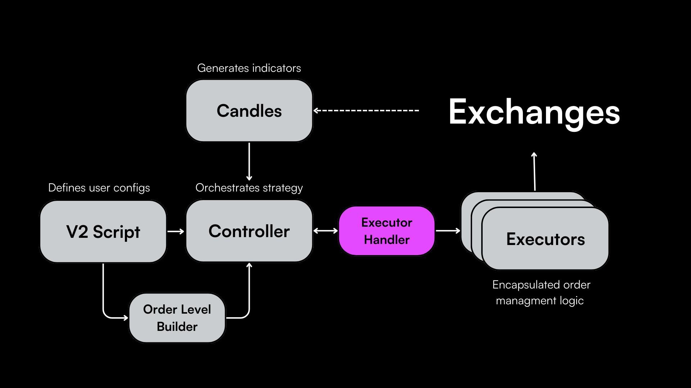

## Executor Handlers in Hummingbot

Executor Handlers in Hummingbot act as the supervisory layer over [Executors](../executors/), coordinating between the strategy’s [Controllers](../controllers/) and the individual Executors. By handling the execution logic, they enable Executors to focus on their specific tasks, like managing positions for profit-taking and loss mitigation, in line with the broader strategy directives.

Currently, Hummingbot offers two types of Executor Handlers tailored for different strategy approaches: **MarketMakingExecutorHandler** and **DirectionalTradingExecutorHandler**, based on the [ExecutorHandlerBase](https://github.com/hummingbot/hummingbot/blob/13aab912ea297a70e52f560cc7239400a1204aa6/hummingbot/smart_components/strategy_frameworks/executor_handler_base.py#L22) class.

You shouldn't need to modify these handlers to use them in your strategies, but understanding how they function is useful.

## Market Making Executor Handler

The [`MarketMakingExecutorHandler`](https://github.com/hummingbot/hummingbot/blob/13aab912ea297a70e52f560cc7239400a1204aa6/hummingbot/smart_components/strategy_frameworks/market_making/market_making_executor_handler.py) class is designed for market-making or grid strategies. It facilitates the simultaneous management of multiple order levels, each potentially with its own Executor, allowing for a multi-layered market-making approach.

**Key Features**

- Manages multiple Executors for different order levels in market-making strategies.
- Integrates with perpetual markets, handling position management including setting leverage and position mode.
- Implements cooldown conditions to prevent Executors from re-entering the market too quickly after a position closes.
- Offers functionality for early stopping of Executors based on custom conditions.
- Creates new Executors when the market conditions meet the strategy’s entry criteria.

## Directional Trading Executor Handler

The [`DirectionalTradingExecutorHandler`](https://github.com/hummingbot/hummingbot/blob/13aab912ea297a70e52f560cc7239400a1204aa6/hummingbot/smart_components/strategy_frameworks/directional_trading/directional_trading_executor_handler.py#L9) class is tailored for directional trading strategies. It operates based on the market signals identified by the Controller to open or close long/short positions, or place buy/sell orders.

**Key Features**

- Manages Executors in response to market signals for directional trading.
- Compatible with perpetual markets, facilitating the setting of leverage and position mode.
- Monitors and responds to market conditions, creating Executors when a directional signal is detected.
- Implements early stop conditions for Executors to close positions based on the strategy’s risk parameters.
