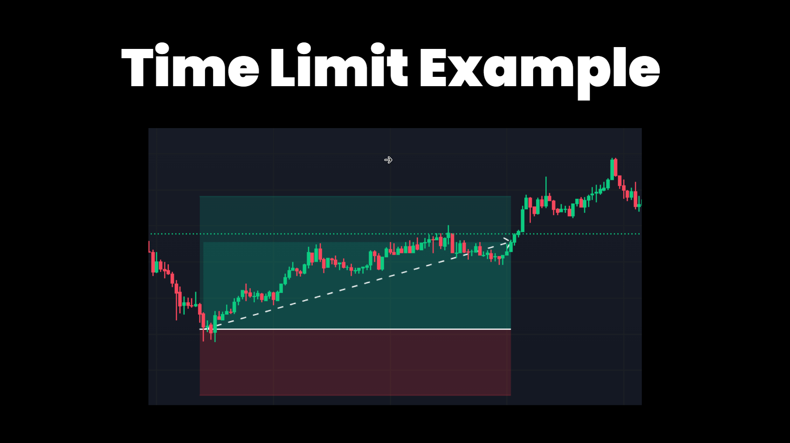
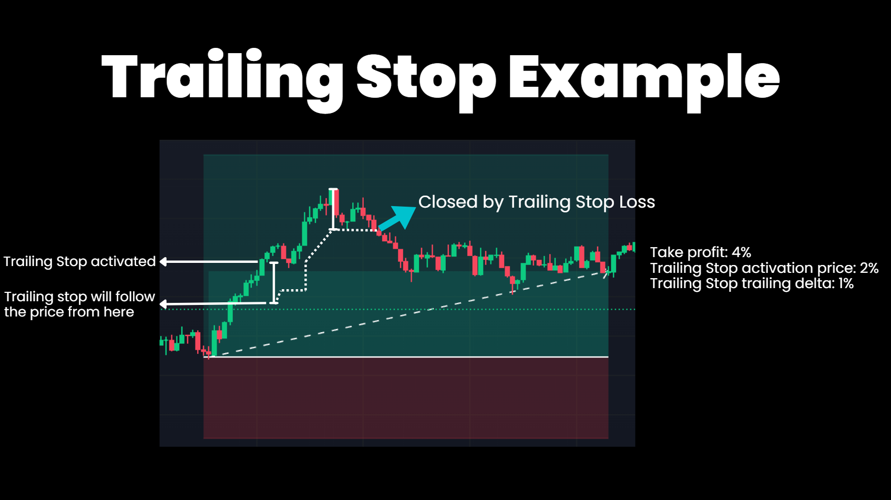

# What are Executors?

Executors are independently functioning modules that can be created and controlled by [Controllers](./controllers.md). They are part of the [V2 Strategy](index.md) framework. The `Executor Handler` manages the executors based on the controller's instructions. Controllers generate signals and include logic for refreshing orders, canceling them, and stopping executors.

One of the key advantages of this framework is the ability to run multiple strategies or sub-strategies in the same script. This allows users to combine different strategies and analyze their average results.

Utilizing these Executors within Hummingbot scripts enables traders to implement complex strategies with ease. The integration process involves:

- Configuring each executor according to the desired trading strategy.
- Embedding the executors within Hummingbot's trading logic.
- Leveraging the executors’ capabilities to enhance trading effectiveness and efficiency.

---

## PositionExecutor

The `PositionExecutor` is a smart component that simplifies trading logic for users managing positions. It is responsible for opening and closing orders based on take profit and stop loss targets.

This component takes as input the strategy and `PositionConfig`, a new data type that includes the information needed to start a directional position on a perpetuals exchange. This utilizes the `triple barrier method` popularized in [Advances in Financial Machine Learning by Martin Prado](https://www.wiley.com/en-us/Advances+in+Financial+Machine+Learning-p-9781119482086).

In comparison to the `ArbitrageExecutor`, the `PositionExecutor` focuses on managing a single trading position with various exit strategies, while the `ArbitrageExecutor` is designed for executing arbitrage opportunities between two different markets. 

The Position Executor is suitable for both `market making` and `directional trading` strategies.


### Triple - Barrier Method


### Sample Code

```python
triple_barrier_confs = TripleBarrierConf(
    stop_loss=stop_loss, take_profit=take_profit, time_limit=time_limit,
    trailing_stop_activation_price_delta=trailing_stop_activation_price_delta,
    trailing_stop_trailing_delta=trailing_stop_trailing_delta),
```

### Configuration

- `stop_loss` (First Barrier - Risk Management):

This is the price level at which a trade is automatically closed to prevent further losses.
If the market moves unfavorably, the stop loss ensures that the trader exits the position before the losses exceed a certain threshold.
It's a critical tool for capital preservation and risk management.


- `take_profit` (Second Barrier - Profit Target):

This is the price level at which a trade is automatically closed to secure profits.
When the market moves favorably and reaches this price, the trade is closed, capturing the gains.
Setting a take-profit helps in realizing the profits without being affected by market reversals or emotional biases.


- `time_limit` (Third Barrier - Time Management):

This is a pre-set duration after which a trade is closed, regardless of its profit or loss status.
The time limit can help in scenarios where a position isn't reaching its profit or loss thresholds but is consuming capital and attention that could be deployed elsewhere.
This parameter is especially useful in strategies where holding a position for too long can be detrimental, such as in fast-moving or highly volatile markets.



- `trailing_stop_activation_price_delta`

This parameter is used to set a trailing stop, which is a dynamic form of stop loss.
The trailing stop activation price delta is the amount by which the price must move in a favorable direction before the trailing stop is activated.
Once activated, the trailing stop will follow the price at a set distance, allowing for the capture of more profit while still protecting against a market reversal.



- `trailing_stop_trailing_delta`

This is the distance the trailing stop will maintain from the current market price after it has been activated.
As the market price moves favorably, the trailing stop adjusts accordingly, maintaining this set distance (delta).
It helps to lock in profits while giving the position room to grow. If the market price reverses and hits the trailing stop, the trade is closed, securing the gains made.

---

## ArbitrageExecutor

The `ArbitrageExecutor` automates the process of identifying and executing profitable arbitrage opportunities between different exchanges or markets. It handles the complexities of order management, price calculations, and profitability analysis.

**Purpose:**

Identifies and executes arbitrage opportunities between two markets for the same trading pair.

**Key Features:**

- Validates arbitrage opportunities based on profitability.
- Manages buy and sell orders across different markets.
- Incorporates interchangeable tokens and stablecoin conditions.
- Calculates net profit and loss, accounting for transaction costs.
- Includes a retry mechanism for order failures.

**Advantages:**

- Automates complex arbitrage strategies.
- Enables real-time profitability calculation and decision-making.
- Effectively manages order placements and executions.

In summary, the `ArbitrageExecutor` and `PositionExecutor` are vital components for traders looking to automate advanced trading strategies in the cryptocurrency market. Their integration into Hummingbot scripts offers enhanced capability, risk management, and profitability in trading operations.
