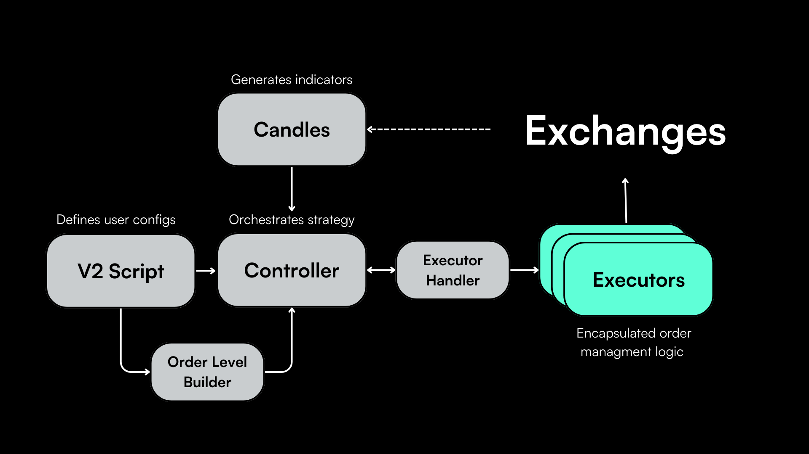

## Introduction to Executors

Executors in Hummingbot are integral components that handle the execution of orders according to predefined conditions set by Controllers, which, in turn, utilize data from Candles. Specifically, Executors are tasked with managing the state of orders—this involves initiating, refreshing, and canceling orders, as well as halting their own operation when certain conditions are met.

**Benefits of Executors**

* Autonomy: Executors independently manage order states, offloading complex logic from the user.
* Simplicity: They simplify strategy code, enabling users to create powerful strategies with ease.
* Flexibility: By dynamically adjusting to market data, Executors can set spreads and shift prices, offering greater strategy adaptability.

Currently, there are two examples in the codebase: **PositionExecutor** and **ArbitrageExecutor**.

## PositionExecutor


The [PositionExecutor](https://github.com/hummingbot/hummingbot/blob/13aab912ea297a70e52f560cc7239400a1204aa6/hummingbot/smart_components/executors/position_executor/position_executor.py) class implements the [Triple Barrier Method](https://www.mlfinlab.com/en/latest/labeling/tb_meta_labeling.html) popularized in Martin Prado's famous book [Advances in Financial Machine Learning](https://www.wiley.com/en-us/Advances+in+Financial+Machine+Learning-p-9781119482086).

The triple barrier method is a structured approach to position management, where three "barriers" determine the outcome of a trade:

* **Stop Loss**: Caps the potential loss on a position.
* **Take Profit**: Secures profits by specifying a target exit price.
* **Time Limit**: Restricts the duration a trade can remain open, adding a temporal dimension to the exit strategy.

Additionally, `PositionExecutor` also contains a **Trailing Stop** mechanism, which dynamically adjusts the stop loss level as favorable price movements occur.


### Spot vs Perpetual Behavior
 
The `PositionExecutor` class is designed to work on both spot and perpetual exchanges, allowing you to write strategies that be used on either type:

* On perpetual exchanges, they apply the take-profit and stop-loss levels described below to manage a long or short position after it has been created.
* On spot exchanges, they place take-profit and stop-loss orders to manage an order after it has been filled. This is similar to [Hanging Orders](/strategy-configs/hanging-orders/) but on an individual order level.


### Configuration

The `PositionExecutor` engages with the market by executing orders based on the `PositionConfig`. It applies the triple barrier method as follows:

```python
triple_barrier_confs = TripleBarrierConf(
    stop_loss=stop_loss,
    take_profit=take_profit,
    time_limit=time_limit,
    trailing_stop_activation_price_delta=trailing_stop_activation_price_delta,
    trailing_stop_trailing_delta=trailing_stop_trailing_delta,
)
```

#### Stop Loss

Activated when the price moves against the position beyond a specified threshold.


#### Take Profit

Triggered when the price reaches a pre-set level that represents a desired profit.


#### Time Limit

When the time limit is reached, the position will be closed or an opposing trade will be executed.


#### Trailing Stop

The trailing stop evaluates the position after a certain time has passed and may close it to avoid market shifts or decay.

- `trailing_stop_activation_price_delta`: The price movement required to activate a trailing stop.
- `trailing_stop_trailing_delta`: The distance maintained behind the price as a trailing stop, which adjusts as the price moves favorably.


### Execution Flow

Here's a simplified flow of how the `PositionExecutor` operates in conjunction with the triple barrier method:

1. The `PositionExecutor` initiates a position based on signals from the Controller, which interprets Candles data.
2. It continuously monitors market prices and compares them against the defined barriers.
3. If the price hits the take profit or stop loss levels, the `PositionExecutor` executes a trade to close the position accordingly.
4. If the trailing stop is activated, it adjusts the stop loss level as the price moves favorably, providing a dynamic risk management tool.
5. The time limit barrier ensures that positions do not remain open indefinitely, addressing the risk of market conditions changing over time.

### Conclusion

The `PositionExecutor` is a powerful tool within Hummingbot for implementing strategies that require precise entry and exit conditions. By leveraging the triple barrier method, it provides a structured and disciplined approach to trade management, vital for both market making and directional trading strategies.

---

## ArbitrageExecutor

### Overview

The [ArbitrageExecutor](https://github.com/hummingbot/hummingbot/blob/13aab912ea297a70e52f560cc7239400a1204aa6/hummingbot/smart_components/executors/arbitrage_executor/arbitrage_executor.py) class is a specialized component within Hummingbot designed for capitalizing on price discrepancies between different markets or exchanges by automating the process of simultaneously executes buy and sell orders on two distinct markets, aiming to exploit arbitrage opportunities for profit.

- **Efficiency**: Automates the complex process of identifying and executing arbitrage opportunities.
- **Speed**: Executes buy and sell orders simultaneously to capture fleeting arbitrage opportunities.
- **Risk Management**: Calculates transaction costs to ensure profitable trades post-fees.
- **Flexibility**: Can be configured for various arbitrage strategies across different markets and exchanges.

### Workflow

Upon initialization, the `ArbitrageExecutor` performs the following actions:

1. **Validation**: Ensures that the proposed arbitrage is valid, with interchangeable trading pairs.
2. **Order Tracking**: Maintains `TrackedOrder` instances for buy and sell orders to monitor their statuses.
3. **Profitability Calculation**: Assesses potential profit, accounting for transaction costs, and executes trades if profitability exceeds the minimum threshold.

### Sample Script

Below, we show code snippets from the [Arbitrage with Smart Component](https://github.com/hummingbot/hummingbot/blob/13aab912ea297a70e52f560cc7239400a1204aa6/scripts/archived_scripts/examples_using_smart_components/arbitrage_with_smart_component.py) script, which provides an example of how to use the ArbitrageExecutor.

You can define the two markets to arbitrage, the order amount, and the arbitrage profitability threshold.

```python
class ArbitrageWithSmartComponent(ScriptStrategyBase):
    # Parameters
    exchange_pair_1 = ExchangePair(exchange="binance", trading_pair="MATIC-USDT")
    exchange_pair_2 = ExchangePair(exchange="uniswap_polygon_mainnet", trading_pair="WMATIC-USDT")
    order_amount = Decimal("50")  # in base asset
    min_profitability = Decimal("0.004")
```

The `create_arbitrage_executor` method is responsible for creating a new `ArbitrageExecutor`. First, it checks available balances on the buying and selling exchanges to ensure there's enough capital to execute the arbitrage. If so, it creates `ArbitrageExecutor` instances based on the settings above. 

```python
def create_arbitrage_executor(self, buying_exchange_pair: ExchangePair, selling_exchange_pair: ExchangePair):
    ...
    arbitrage_config = ArbitrageConfig(
        buying_market=buying_exchange_pair,
        selling_market=selling_exchange_pair,
        order_amount=self.order_amount,
        min_profitability=self.min_profitability,
    )
```
