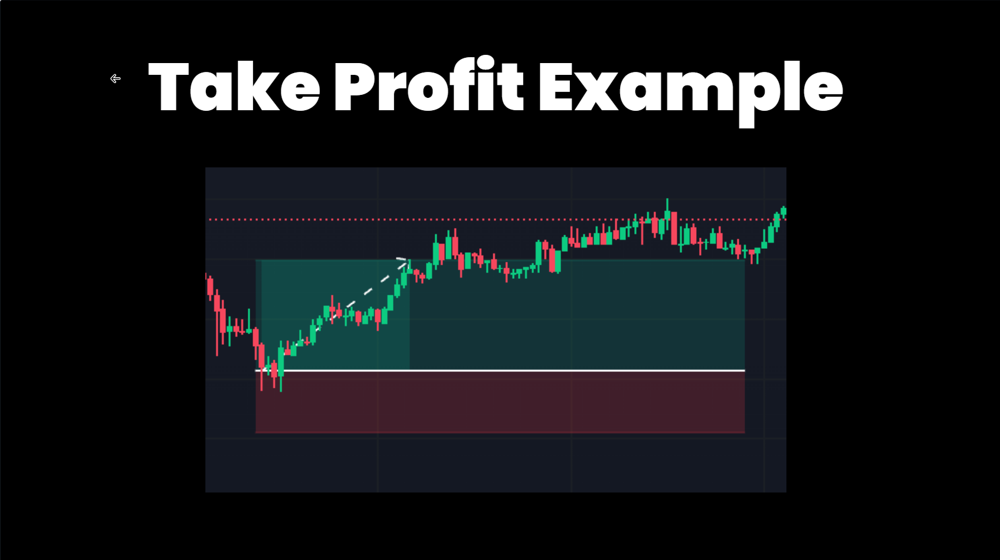

**PositionExecutor:** Manages opening and closing positions of equal amounts, ensuring the portfolio remains balanced ± the position's profit or loss. It's applicable in both perpetual and spot markets, requiring pre-ownership of the asset for spot markets.

The **PositionExecutor** uses a configuration object, **PositionExecutorConfig**, to manage an order after it is placed, following the [Triple Barrier Method](https://www.mlfinlab.com/en/latest/labeling/tb_meta_labeling.html). This configuration sets pre-defined stop loss, take profit, time limit, and trailing stop parameters.


```python
class TripleBarrierConf(BaseModel):
    # Configure the parameters for the position
    stop_loss: Optional[Decimal]
    take_profit: Optional[Decimal]
    time_limit: Optional[int]
    trailing_stop_activation_price_delta: Optional[Decimal]
    trailing_stop_trailing_delta: Optional[Decimal]
    # Configure the parameters for the order
    open_order_type: OrderType = OrderType.LIMIT
    take_profit_order_type: OrderType = OrderType.MARKET
    stop_loss_order_type: OrderType = OrderType.MARKET
    time_limit_order_type: OrderType = OrderType.MARKET
```

Key Configs:

- `stop_loss`: Determines the stop-loss percentage
- `take_profit`: Sets the take-profit percentage.
- `time_limit`:  Establishes a time limit for the trade.
- `trailing_stop_activation_price_delta`: Specifies the delta for activating a trailing stop.
- `trailing_stop_trailing_delta`: Sets the trailing delta for the trailing stop.

Example:


The [PositionExecutor](https://github.com/hummingbot/hummingbot/blob/13aab912ea297a70e52f560cc7239400a1204aa6/hummingbot/smart_components/executors/position_executor/position_executor.py) class implements the [Triple Barrier Method](https://www.mlfinlab.com/en/latest/labeling/tb_meta_labeling.html) popularized in Martin Prado's famous book [Advances in Financial Machine Learning](https://www.wiley.com/en-us/Advances+in+Financial+Machine+Learning-p-9781119482086).

The triple barrier method is a structured approach to position management, where three "barriers" determine the outcome of a trade:

* **Stop Loss**: Caps the potential loss on a position.
* **Take Profit**: Secures profits by specifying a target exit price.
* **Time Limit**: Restricts the duration a trade can remain open, adding a temporal dimension to the exit strategy.

Additionally, `PositionExecutor` also contains a **Trailing Stop** mechanism, which dynamically adjusts the stop loss level as favorable price movements occur.


### Spot vs Perpetual Behavior
 
The `PositionExecutor` class is designed to work on both spot and perpetual exchanges, allowing you to write strategies that be used on either type:

* On perpetual exchanges, they apply the take-profit and stop-loss levels described below to manage a long or short position after it has been created.
* On spot exchanges, they place take-profit and stop-loss orders to manage an order after it has been filled. This is similar to [Hanging Orders](/strategy-configs/hanging-orders/) but on an individual order level.


### Configuration

The `PositionExecutor` engages with the market by executing orders based on the `PositionConfig`. It applies the triple barrier method as follows:

```python
triple_barrier_confs = TripleBarrierConf(
    stop_loss=stop_loss,
    take_profit=take_profit,
    time_limit=time_limit,
    trailing_stop_activation_price_delta=trailing_stop_activation_price_delta,
    trailing_stop_trailing_delta=trailing_stop_trailing_delta,
)
```

#### Stop Loss

Activated when the price moves against the position beyond a specified threshold.


#### Take Profit

Triggered when the price reaches a pre-set level that represents a desired profit.




#### Time Limit

When the time limit is reached, the position will be closed or an opposing trade will be executed.


#### Trailing Stop

The trailing stop evaluates the position after a certain time has passed and may close it to avoid market shifts or decay.

- `trailing_stop_activation_price_delta`: The price movement required to activate a trailing stop.
- `trailing_stop_trailing_delta`: The distance maintained behind the price as a trailing stop, which adjusts as the price moves favorably.


### Execution Flow

Here's a simplified flow of how the `PositionExecutor` operates in conjunction with the triple barrier method:

1. The `PositionExecutor` initiates a position based on signals from the strategy, which interprets market data
2. It continuously monitors market prices and compares them against the defined barriers.
3. If the price hits the take profit or stop loss levels, the `PositionExecutor` executes a trade to close the position accordingly.
4. The trailing stop is adjusted as the price moves favorably, providing a dynamic risk management tool.
5. The time limit barrier ensures that positions do not remain open indefinitely, addressing the risk of market conditions changing over time.

### Conclusion

The `PositionExecutor` is a powerful tool within Hummingbot for implementing strategies that require precise entry and exit conditions. By leveraging the triple barrier method, it provides a structured and disciplined approach to trade management, vital for both market making and directional trading strategies.

---
