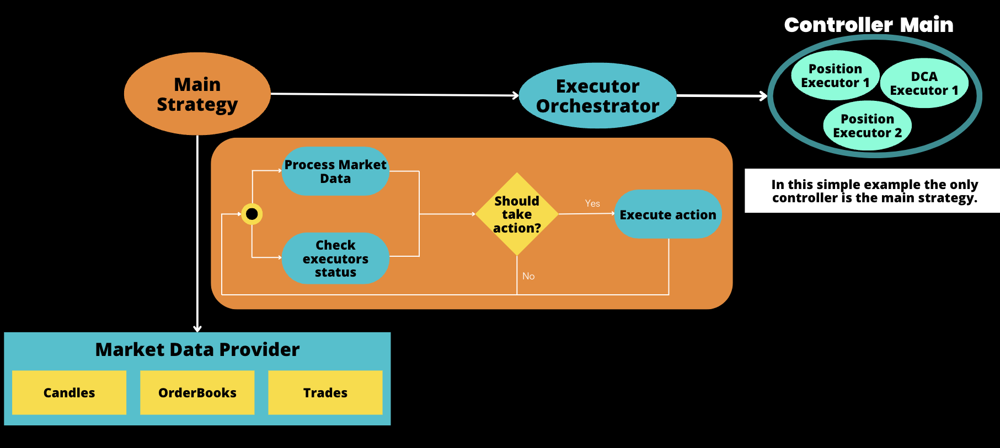

The Strategies V2 framework is built on a foundation of interlocking components that can be combined with one another to create powerful trading strategies. The most important components to understand are:

* [**Executors**](./executors/index.md): Components that manages orders and positions based on pre-defined user settings, ensuring that orders are placed, modified, or canceled according to the strategy's instructions.
* [**Market Data Provider**](./data/index.md): Provides access to exchange market data such as historical OHCLV candles, order book data, and trades.
* [**Controllers**](./controllers/index.md): Defines a trading strategy based on a controller base class

!!! tip
    Controllers now have access to the MarketDataProvider and works like a sub-strategy,  which means users can now run a script using multiple controllers.  

## Why Strategies V2?

The development of the Strategies V2 framework was motivated by the need to overcome several challenges and limitations of the previous strategy implementation:

- **Scalability Issues:** Initially, each trading strategy was limited to a single bot, complicating management and scalability across various strategies and scenarios.

- **Lack of Historical Data Support:** Earlier strategies couldn't leverage historical market data, requiring traders to wait for real-time data accumulation before trading.

- **Complex Order and Event Tracking:** Managing multiple orders across different pairs and exchanges was cumbersome, especially when adjusting strategies in response to market changes.

- **Explainability and Improvement Challenges:** The lack of clear action-outcome correlations made it difficult to analyze and improve strategy performance.

- **Repetitive Behavior Implementation:** Common behaviors, like order refreshing in market making, were often redundantly implemented, leading to inefficiencies.

- **Technical Barriers to Market Data Access:** The necessity for a deep understanding of foundational classes and the use of Cython obscured type hints and steepened the learning curve.

- **Limited Backtesting Capabilities:** The original framework's lack of comprehensive backtesting tools restricted strategy evaluation against historical data.