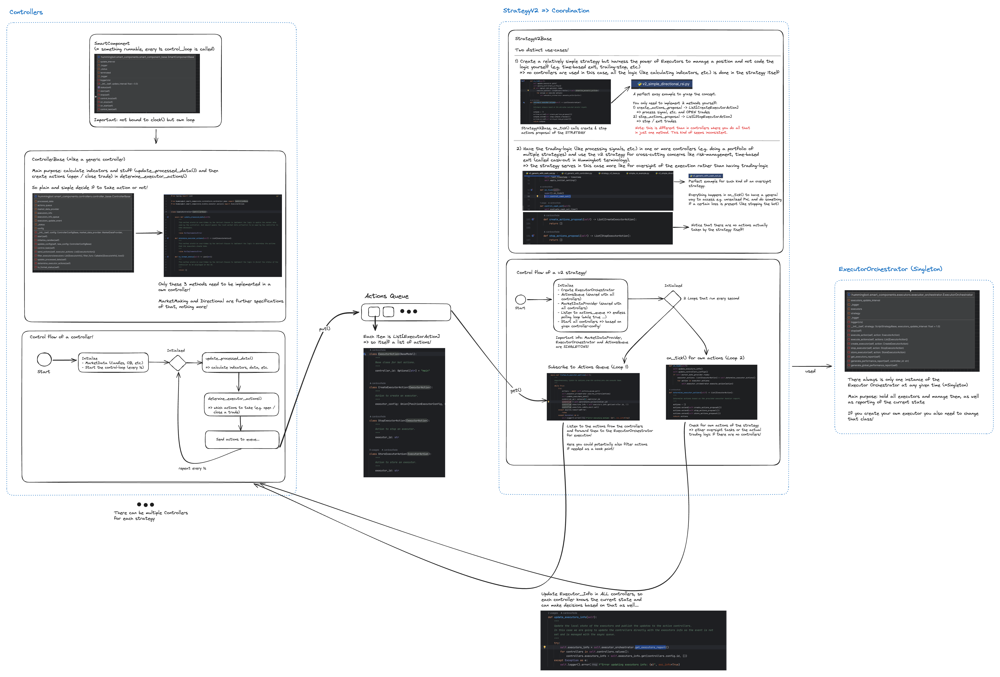

The StrategyV2 framework contains a set of interlocking components that can be combined to create powerful, customized algo trading strategies.

This diagram shows a high-level conceptual overview of all components of the V2 framework. 

The most important components to understand are:

* [**Script**](#strategyv2-script): Orchestrates the overall strategy logic. This is a standard [script](/scripts) that inherits from the `StrategyV2Base` class. 
* [**Executor**](./executors/index.md): Manages orders and positions based on pre-defined user settings, ensuring that orders are placed, modified, or canceled according to the strategy's instructions.
* [**Controller (optional)**](./controllers/index.md): Defines a trading strategy based on a strategy controller base class, i.e. Directional or Market Making.
* [**Market Data Provider**](./data/index.md): Single point of access to exchange market data such as historical OHCLV [Candles](./candles/index.md), order book data, and trades.

## Technical Overview / Cheatsheet

A more technical overview, showing the control flow between the components as well as snippets of the relevant code from Hummingbot:

This can also be downloaded as [PDF](strategy-v2-overview.pdf).

## Two ways to create strategies

There are two ways to create strategies using the StrategyV2 framework:

* Scripts that use StrategyV2 components like the Market Data Provider and Executors
* Controllers that house the strategy logic. This allows a single loader script to manage multiple Controller configurations.

See the table below to decide which type to use:

| StrategyV2 Script                                                                | StrategyV2 Controller                                                                 |
|--------------------------------------------------------------------------------------|---------------------------------------------------------------------------------------------|
| The strategy is relatively simple                                                    | You want to manage the risk and diversify your portfolio in different controllers           |
| The logic is very standard across different trading pairs                             | The strategy is complex and you want to isolate the decision making                         |
| The strategy only trades on one trading pair                                          | You want to try multiple configs in the same bot                                            |
| You are getting started with Executors and you want a simple way to code your strategy | The strategy trades on multiple trading pairs                                               |
| Prototype a strategy                                                                  | You are familiar with the Strategy V2 and how the controllers interact with it              |

## StrategyV2 Script

Here you can see a simplified version of the above drawing, where **everything is done in the StrategyV2 Script without any Controller**. Logically, the strategy serves here as the main
Controller, but there is no separate class involved.

Check out [Walkthrough](./walkthrough.md) for a simple RSI strategy and also look at the source code to understand how all that plays together.

## StrategyV2 Controller

This is the more advanced version, shown in the drawing above, allowing you to run multiple Controllers if needed and a StrategyV2 Script for management.

To not require you to always code a management strategy yourself, there is a [Generic Strategy](https://github.com/hummingbot/hummingbot/blob/development/scripts/v2_with_controllers.py) included in Hummingbot that can be used for that purpose. 

Check out [Walkthrough - Controller](./walkthrough-controller.md) to learn how to use it.