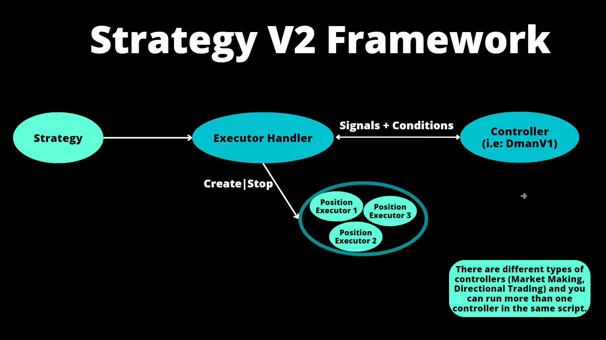

## What are V2 Strategies?

Historically, Hummingbot's [strategies](../v1-strategies/index.md) were monolithic constructs, offering substantial reliability but limited adaptability. This model, while robust, posed adaptability challenges, especially for users without the Python experience needed to modify the code.

In contrast, V2 Strategies are designed to be:

* **Composable**: V2 strategies are **modular** and designed to facilitate seamless integration and detachment of components, ensuring rapid and efficient strategy modification to adapt to dynamic market conditions.
* **Backtestable**: Critical for any professional trading strategy, V2 strategies are designed to be **backtested using market data** across large-scale simulations.
* **Accessible**: V2 strategies are designed to be created, backtested and deployed using [Dashboard](../dashboard/index.md), providing access to both non-technical and technical users alike.

## Architecture

V2 strategies are composed of various components that the user defines via a [Script](../scripts/index.md) entry point:

* [Candles](./candles-feed.md): Candles structure both historical and real-time market data into seamless OHLCV candles and synthesize refined signals to inform trading decisions.
* [Controllers](./controllers.md): Responding to signals generated by Candles, Controllers orchestrate the overall strategy, determining which Executors to deploy, adjust, or retire.
* [Executors](./executors.md): The operational arm of the strategy, Executors are self-encapsulated logical elements that ensure precise trade execution, timely response to market dynamics, and meticulous order lifecycle management.

