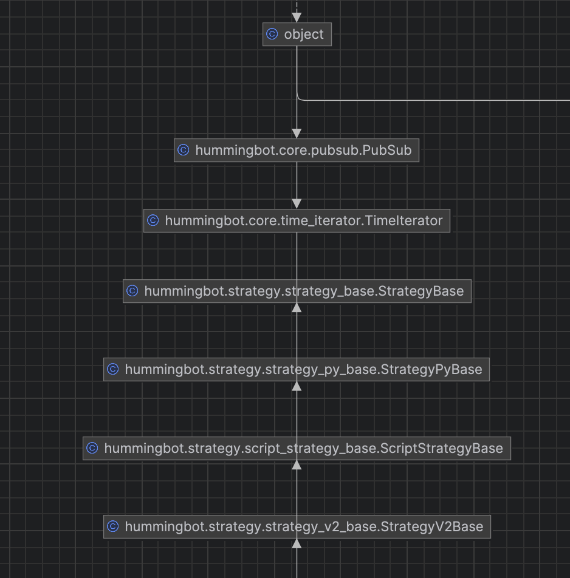

## Components

The most important components to understand are:

* [**Script**](./scripts/index.md): Entry point for all strategies, this Python file orchestrates the strategy. It may be a simple file that contains all strategy logic, or one that loads one or more Controllers.
* [**Market Data Provider**](./data/index.md): Single point of access to exchange market data such as historical OHCLV [Candles](./candles/index.md), order book data, and trades.
* [**Executor**](./executors/index.md): Manages orders and positions based on pre-defined user settings, ensuring that orders are placed, modified, or canceled according to the strategy's instructions.
* [**Controller**](./controllers/index.md): Defines a trading strategy based on a strategy controller base class, i.e. Directional or Market Making.

## Inheritance

One important information before we delve into the details of each strategy type and when to use which is to understand that they are all built on top of each other.

If we have a quick look together at the inheritance hierarchy this becomes obvious:

* **V1 Strategies**: `StrategyBase` is the Cython base class for all strategies, while `StrategyPyBase` extends it and serves as the root for all Python-based strategies
* **V1 Scripts**: `ScriptStrategyBase` builds on top of these classes and makes it a lot easier to create a simple strategy with nearly no code. This class is still fully supported, but might be deprecated in the future. Therefore we recommend using `StrategyV2Base` for new script implementations.
* **Controllers and V2 Scripts**: `StrategyV2Base` inherits from `ScriptStrategyBase`, but uses Executors for order management instead of the `buy()` / `sell()` methods. Controllers extend that even further as additional components that are loosely couple via an event queue. 

Please make sure to keep the inheritance structure in mind as this helps you a lot in learning how to code your own custom strategies.

## Strategy Guides

Check out [Walkthrough - Script](./walkthrough.md) and [Walkthrough - Controller](./walkthrough-controller.md) to learn how to create strategies.

