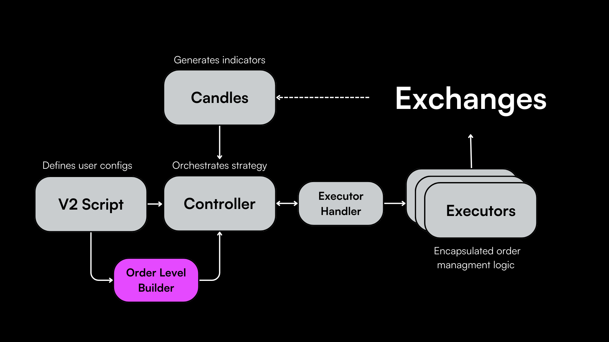
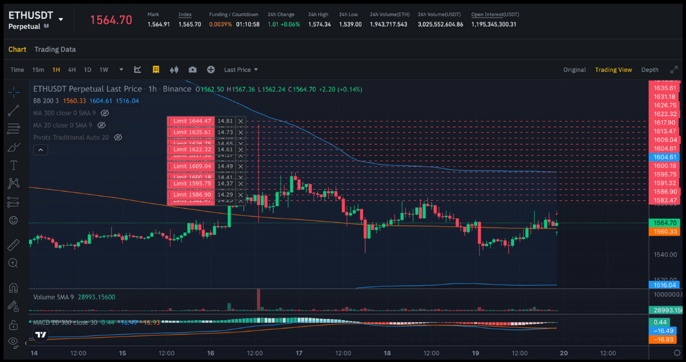
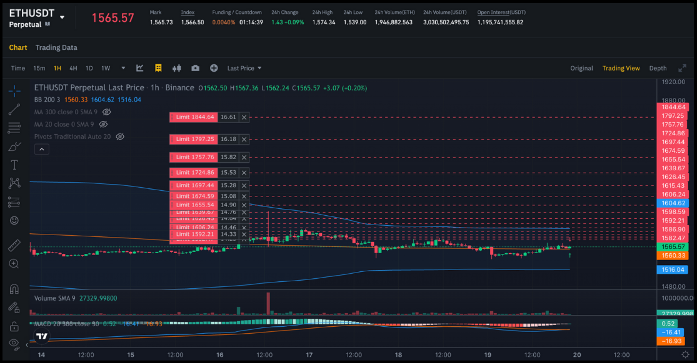
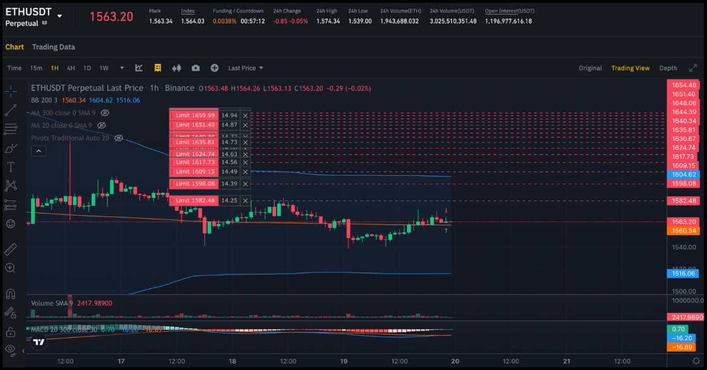

In Hummingbot V1 strategies like Pure Market Making and Avellaneda, [order levels](/strategy-configs/order-levels/) are a frequently used parameter that helps users customize order placement. With V2 strategies, their configurability has been considerably enhanced.

There are two ways to set order levels in V2 strategies: manually and using the Order Level Builder.

## Manual Order Levels

Manual configuration of order levels allows for precise control over the trading strategy. Here's an example from the [DMan-Composed](https://github.com/hummingbot/hummingbot/blob/13aab912ea297a70e52f560cc7239400a1204aa6/scripts/v2_market-making_dman_composed.py) script:

```python
config_v1 = DManV1Config(
    exchange="binance_perpetual",
    trading_pair=trading_pair,
    order_levels=[
        OrderLevel(level=0, side=TradeType.BUY, order_amount_usd=Decimal("15"),
                    spread_factor=Decimal(1.0), order_refresh_time=60 * 30,
                    cooldown_time=15, triple_barrier_conf=triple_barrier_conf_top),
        OrderLevel(level=1, side=TradeType.BUY, order_amount_usd=Decimal("50"),
                    spread_factor=Decimal(5.0), order_refresh_time=60 * 30,
                    cooldown_time=15, triple_barrier_conf=triple_barrier_conf_bottom),
        OrderLevel(level=2, side=TradeType.BUY, order_amount_usd=Decimal("50"),
                    spread_factor=Decimal(8.0), order_refresh_time=60 * 15,
                    cooldown_time=15, triple_barrier_conf=triple_barrier_conf_bottom),
        OrderLevel(level=0, side=TradeType.SELL, order_amount_usd=Decimal("15"),
                    spread_factor=Decimal(1.0), order_refresh_time=60 * 30,
                    cooldown_time=15, triple_barrier_conf=triple_barrier_conf_top),
        OrderLevel(level=1, side=TradeType.SELL, order_amount_usd=Decimal("50"),
                    spread_factor=Decimal(5.0), order_refresh_time=60 * 30,
                    cooldown_time=15, triple_barrier_conf=triple_barrier_conf_bottom),
        OrderLevel(level=2, side=TradeType.SELL, order_amount_usd=Decimal("50"),
                    spread_factor=Decimal(8.0), order_refresh_time=60 * 15,
                    cooldown_time=15, triple_barrier_conf=triple_barrier_conf_bottom),
    ],
    candles_config=[
        CandlesConfig(connector="binance_perpetual", trading_pair=trading_pair, interval="3m", max_records=1000),
    ],
    leverage=25,
    natr_length=21
)
```

- `OrderLevel`: Represents a specific configuration for an order. Higher levels (e.g., level 3) may denote larger or more aggressive orders compared to lower levels (e.g., level 1).

- `side=TradeType`: Dictates the type of the order: either `BUY` or `SELL`. This parameter defines the direction of the trade.

- `order_amount_usd`: Specifies the monetary value of the order in USD. Different levels can have varied order amounts, offering a tiered approach to market engagement and risk distribution.

- `spread_factor`: A multiplier that influences the order's placement price relative to the current market price. Higher spread factors typically result in orders placed further from the current price, possibly aiming to capitalize on predicted market movements.

- `order_refresh_time`: The duration (in seconds) after which the order is reassessed or replaced. This is particularly important in volatile markets, where conditions can shift swiftly.

- `cooldown_time`: A time interval (in seconds) that follows the execution of an order, during which no new orders at the same level are placed. This mechanism helps in mitigating overexposure in rapidly changing market scenarios.

- `triple_barrier_conf`: A [PositionExecutor](../executors) configuration thats manages orders after execution, like stop losses or take profits.


## Order Level Builder

The [Order Level Builder](https://github.com/hummingbot/hummingbot/blob/13aab912ea297a70e52f560cc7239400a1204aa6/hummingbot/smart_components/utils/order_level_builder.py), a feature of Hummingbot's V2 strategies framework, streamlines the creation of order level distributions. By leveraging this class, users can efficiently define complex order arrangements.

For instance, the [DMan-V3](https://github.com/hummingbot/hummingbot/blob/13aab912ea297a70e52f560cc7239400a1204aa6/scripts/v2_market-making_dman_v3_multiple_pairs.py) script specifies arithmetic distribution of 5 order levels, starting at 50% of the Bollinger Band width and incrementing every 30%.

```python
# Orders configuration
order_amount = Decimal("25")
n_levels = 5
start_spread = 0.5  # percentage of the bollinger band (0.5 means that the order will be between the bollinger mid-price and the upper band)
step_between_orders = 0.3  # percentage of the bollinger band (0.1 means that the next order will be 10% of the bollinger band away from the previous order)

# Applying the configuration
order_level_builder = OrderLevelBuilder(n_levels=n_levels)
order_levels = order_level_builder.build_order_levels(
    amounts=order_amount,
    spreads=Distributions.arithmetic(n_levels=n_levels, start=start_spread, step=step_between_orders),
    triple_barrier_confs=TripleBarrierConf(
        stop_loss=stop_loss, take_profit=take_profit, time_limit=time_limit,
        trailing_stop_activation_price_delta=trailing_stop_activation_price_delta,
        trailing_stop_trailing_delta=trailing_stop_trailing_delta),
)
```

Here are the various distributions that you can create.

### Linear Distribution

Defines a series of order levels with equal spacing between the start and end values.

```python
spreads = Distributions.linear(n_levels=15, start=0.4, end=2.5)
```

- `n_levels`: Total count of order levels.
- `start`: Spread for the initial order level.
- `end`: Spread for the final order level.


**Summary:**

- Provides an evenly distributed set of order levels.
- Ideal for strategies needing a consistent spread.
- The midpoint of the distribution represents the breakeven price.

### Arithmetic Distribution

Incrementally increases the spread of each order level by a fixed step from the starting value.

```python
spreads = Distributions.arithmetic(n_levels=15, start=0.4, step=0.2)
```

- `n_levels`: Total number of order levels.
- `start`: Starting spread value.
- `step`: Incremental increase of the spread per level.



**Summary:**

- Suitable for a gradual and predictable increase in order levels.
- Ensures a fixed increment between the spreads of consecutive levels.

### Geometric Distribution

Multiplies the spread of each order level by a constant ratio for exponential growth.

```python
spreads = Distributions.geometric(n_levels=15, start=0.4, ratio=1.2)
```

- `n_levels`: Total number of order levels.
- `start`: Spread for the initial order level.
- `ratio`: Multiplier for the spread increase.



**Summary:**

- Widens order level spacing, which may be beneficial in volatile markets.
- Suitable for market making distributions

### Logarithmic Distribution

Generates order levels with spreads that increase logarithmically.

```python
spreads = Distributions.logarithmic(n_levels=15, base=10, scaling_factor=1.0, start=0.4)
```

- `n_levels`: Total number of order levels.
- `base`: Base of the logarithm determining spread increase rate.
- `scaling_factor`: Adjusts spread differences between levels.
- `start`: Initial spread value.



**Summary:**

- Ideal for strategies focused on mean reversion.
- Allows for denser order placement away from the mid price, improving breakeven price as order levels are filled.
