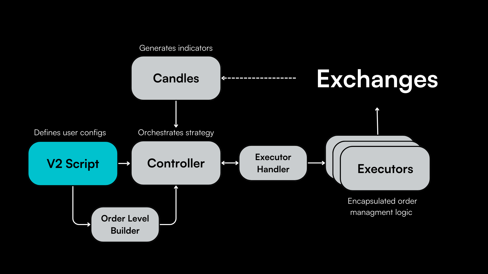

A script serves as the main entry point for a V2 strategy and lets the user define its configuration parameters and import the [Controller](../controllers/) which orchestrates the overall strategy behavior.

Below, we walk through the code of the [DMan-V3 script](https://github.com/hummingbot/hummingbot/blob/master/scripts/v2_market-making_dman_v3_multiple_pairs.py) that utilizes the DMan-V3 controller.

## Script Inheritance

Like all Hummingbot scripts, the DManV3 script inherits from the [`ScriptStrategyBase`](https://github.com/hummingbot/hummingbot/blob/13aab912ea297a70e52f560cc7239400a1204aa6/hummingbot/strategy/script_strategy_base.py) class. It instantiates a dictionary of `connectors` that interface with various exchanges to facilitate trading operations.

```
class DManV3MultiplePairs(ScriptStrategyBase):
```

## Configuration Parameters

The initial section of DManV3 script lets the user define all the configuration parameters of the strategy:
```python
    # Account configuration
    exchange = "binance_perpetual"
    trading_pairs = ["ETH-USDT"]
    leverage = 20

    # Candles configuration
    candles_exchange = "binance_perpetual"
    candles_interval = "1h"
    candles_max_records = 300
    bollinger_band_length = 200
    bollinger_band_std = 3.0

    # Orders configuration
    order_amount = Decimal("25")
    n_levels = 5
    start_spread = 0.5  # percentage of the bollinger band (0.5 means that the order will be between the bollinger mid-price and the upper band)
    step_between_orders = 0.3  # percentage of the bollinger band (0.1 means that the next order will be 10% of the bollinger band away from the previous order)

    # Triple barrier configuration
    stop_loss = Decimal("0.01")
    take_profit = Decimal("0.03")
    time_limit = 60 * 60 * 6
    trailing_stop_activation_price_delta = Decimal("0.008")
    trailing_stop_trailing_delta = Decimal("0.004")

    # Advanced configurations
    side_filter = True
    dynamic_spread_factor = True
    dynamic_target_spread = False
    smart_activation = False
    activation_threshold = Decimal("0.001")
```

You can define one or more [Candles](../candles), a moving window of historical OHLCV data along with computed indicators that can be used to dynamically define your strategy.

Above, `candles_exchanges`, where data is sourced, is identical to `exchange`, where [Executors](../executors/) are placed. However, you may utilize different exchanges to utilize data from larger, more liquid exchanges to trade on smaller, less liquid venues.

### Orders Execution

- `exchange`: Specifies the exchange where the strategy will be executed.
- `trading_pairs`: Lists the trading pairs to be monitored and traded.
- `leverage`: Sets the leverage level for trades.

### Candles Exchange

- `candles_exchange`: Designates the exchange source for candle data.
- `candles_interval`: Defines the time interval for each candle.
- `candles_max_records`: Limits the number of candle records to be maintained.
- `bollinger_band_length`: Determines the length of the Bollinger Bands calculation.
- `bollinger_band_std`: Specifies the standard deviation multiplier for Bollinger Bands.

### Orders Configuration

- `order_amount`: Sets the default amount for each order.
- `n_levels`: Specifies the number of order levels to be created.
- `start_spread`: Defines the initial spread as a percentage of the Bollinger Band width.
- `step_between_orders`: Sets the increment between successive order levels, again as a percentage of the Bollinger Band width.

### Triple Barrier Configuration

- `stop_loss`: Determines the stop-loss percentage.
- `take_profit`: Sets the take-profit percentage.
- `time_limit`: Establishes a time limit for the trade.
- `trailing_stop_activation_price_delta`: Specifies the delta for activating a trailing stop.
- `trailing_stop_trailing_delta`: Sets the trailing delta for the trailing stop.

### Advanced Configurations

- `side_filter`: Toggles the use of side filtering in strategy decision-making.
- `dynamic_spread_factor`: Enables dynamic adjustment of the spread factor.
- `dynamic_target_spread`: Allows dynamic targeting of spreads.
- `smart_activation`: Activates intelligent trade initiation based on predefined conditions.
- `activation_threshold`: Sets the threshold for smart activation.

## Initialization

For each pair where the bot is trading, a `DManV3` controller object is created with the user-defined controller configuration:

```python
for trading_pair in trading_pairs:
        config = DManV3Config(
            exchange=exchange,
            trading_pair=trading_pair,
            order_levels=order_levels,
            candles_config=[
                CandlesConfig(connector=candles_exchange, trading_pair=trading_pair,
                              interval=candles_interval, max_records=candles_max_records),
            ],
            bb_length=bollinger_band_length,
            bb_std=bollinger_band_std,
            side_filter=side_filter,
            dynamic_spread_factor=dynamic_spread_factor,
            dynamic_target_spread=dynamic_target_spread,
            smart_activation=smart_activation,
            activation_threshold=activation_threshold,
            leverage=leverage,
        )
        controller = DManV3(config=config)
        markets = controller.update_strategy_markets_dict(markets)
        controllers[trading_pair] = controller

```

## `on_tick`

This method acts as the script's heartbeat, is called regularly, and is responsible for starting [executor handlers](../executor-handlers/) if they have not been started already. It allows the strategy to adapt to new market conditions in real time.

```python
def on_tick(self):
    for executor_handler in self.executor_handlers.values():
        if executor_handler.status == ExecutorHandlerStatus.NOT_STARTED:
            executor_handler.start()
```

## `format_status`

This overrides the standard `status` function and provides a formatted string representing the current status of the strategy, including the name, trading pair, and status of each executor.

Users can customize this function to display their custom strategy variables.

```python
def format_status(self) -> str:
        if not self.ready_to_trade:
            return "Market connectors are not ready."
        lines = []
        for trading_pair, executor_handler in self.executor_handlers.items():
            lines.extend(
                [f"Strategy: {executor_handler.controller.config.strategy_name} | Trading Pair: {trading_pair}",
                 executor_handler.to_format_status()])
        return "\n".join(lines)
```
