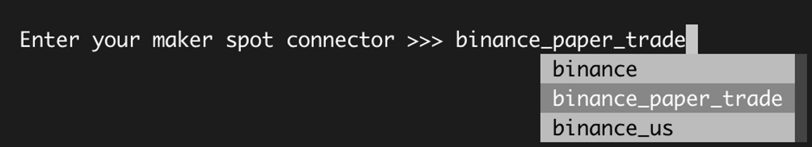
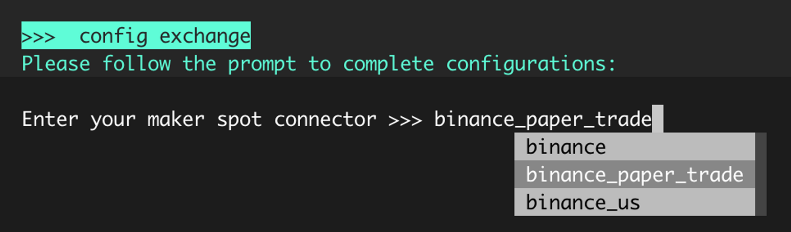
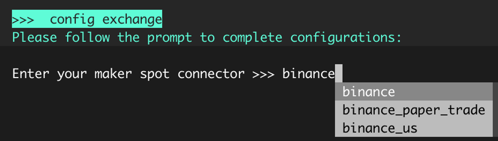

# Paper Trading

This feature allows users to test Hummingbot and simulate trading strategies without risking any actual assets. Paper trading allows you to use most of the hummingbot strategies so you can have a better understanding of how each parameter works with another and expected behavior.

While paper trading prepares you to your first Hummingbot journey, keep in mind that the results and data are not the same when doing live trading as you have to be aware of the risks specially you are using with real assets!

!!! note
    Exchange APIs are not required to run the bot on paper_trade for market making strategies like Pure market making, Cross-exchange market making and Avellaneda strategy

## Adding exchanges

Users can now add paper exchanges by adding the exchange of choice in `conf_client.yml`. Previously, it was only available for AscendEX, Binance, Gate io, and Kucoin. Users can find `conf_client.yml` in `hummingbot/conf/conf_client.yml`

Add the paper trade exchange, for example `Kraken`, to `conf_client.yml`

```
paper_trade:
  paper_trade_exchange:
    - binance
    - kucoin
    - ascend_ex
    - gate_io
    - kraken
```

In the Hummingbot client, `kraken_paper_trade` should now be available when you select an exchange:

`Enter your maker spot connector >>> kraken_paper_trade`

## Enabling and Disabling

Paper trading can be enabled when creating a strategy and choosing an exchange when prompted `Enter your maker spot connector` during the creation of the strategy.



Alternatively, you can enable paper trading by inputting `config exchange` then choose the exchange that supports paper trade.



To choose a different connector and go live, simply choose the exchange name without the `paper_trade` suffix then do the command `stop` and `start` so the changes will reflect on your configuration.



## Adding Paper Trade Balance

By default, the paper trade account has the following tokens and balances which you can see when you run the `balance paper` command.

```
>>>  balance paper
Paper account balances:
    Asset    Balance
      DAI  1000.0000
      ETH    10.0000
      ONE  1000.0000
     TUSD  1000.0000
     USDC  1000.0000
     USDQ  1000.0000
     USDT  1000.0000
     WETH    10.0000
      ZRX  1000.0000
```

When adding balances, specify the asset and balance you want by running this command `balance paper [asset] [amount]`.

For example, we want to add 0.5 BTC and check our paper account balance to confirm.

```
>>>  balance paper BTC 0.5
Paper balance for BTC token set to 0.5

>>>  balance paper
Paper account balances:
    Asset    Balance
      BTC     0.5000
      DAI  1000.0000
      ETH    10.0000
      ONE  1000.0000
     TUSD  1000.0000
     USDC  1000.0000
     USDQ  1000.0000
     USDT  1000.0000
     WETH    10.0000
      ZRX  1000.0000

```

## Exchange testnets

Some of our connectors also support testnet which can also be used experimentation without the risk of losing real funds. You may want to check the following connectors

| Connector | Spot | Perpetual |
| --- | --- | --- |
| Binance |  | binance_perpetual_testnet |
| Bybit | bybit_testnet | bybit_perpetual_testnet |
| Ndax | ndax_testnet |  |

| Chain | Testnet |
| --- | --- |
| Ethereum | Goerli |
| Avalanche | Fuji |
| Binance Smart Chain | BSC testnet |
| Polygon | Mumbai |
