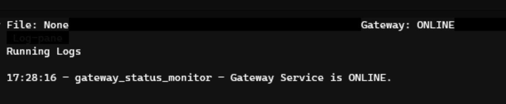

The official Github repository for Gateway is <https://github.com/hummingbot/gateway>. Gateway is released monthly  with the same cadence as the [Hummingbot client](https://github.com/hummingbot/hummingbot), and it follows the same conventions for releases, contributions, etc.

## Prerequisites

These instructions assumes that you have already installed Hummingbot on the machine where you are installing Gateway, either from source or via Docker. See [Installation](/installation/) for more information.

## Generate certs

The first step is to generate self-signed certificates from the Hummingbot client. These certificates let your bots securely communicate with Gateway.

Start Hummingbot. After entering your password, run `gateway generate-certs`:

[](../assets/generate-certs.png)

Enter a secure **passphrase**, and then Hummingbot will generate self-signed certificates that a server can use to authenticate its connection with this client.

Take note of the **path** where they are stored. This is also stored as `certs_path` in the Hummingbot's `conf_client.yml`, the global configuration file in the `/conf/` directory.

[](../assets/certs-path.png)

!!! tip
    Make sure to save both **passphrase** and **certs_path** since you’ll need them later.

## Install Gateway

Select only one of the methods below, since multiple Gateways on the same machine may result in conflicts.

### From source

Install the following dependencies:

- [NodeJS](https://nodejs.org/) (use 16.0.0 or higher)
- [Yarn](https://yarnpkg.com/): run `npm install -g yarn` after installing NodeJS

Then, follow the instructions below:

```bash
# Clone repo and enter the created directory
$ git clone https://github.com/hummingbot/gateway.git
$ cd gateway

# Install dependencies
$ yarn

# Complile Typescript into Javascript
$ yarn build

# Run Gateway setup script, which helps you set configs and certificates
$ chmod a+x gateway-setup.sh
$ ./gateway-setup.sh
```

The `gateway-setup` script configures Gateway by:

- Copying the default configuration files from `/src/templates` to `/conf/` folder
- Copying the Hummingbot self-signed certificates into the `/certs/` folder. Enter **certs_path** when prompted.

!!! note "Alternative to copying certs files"
    The `gateway-setup.sh` script creates a copy of the Hummingbot certificates in the Gateway folder. Alternatively, you can override the **certs_path** parameter in `conf/server.yml` and enter the path to the Hummingbot certificates.

Afterwards, start Gateway using **passphrase**:

```
yarn start --passphrase=<passphrase>
```

### Using Docker

See the [Deploy Examples](https://github.com/hummingbot/deploy-examples) repo for example for deploying various configurations of Hummingbot and Gateway using Docker. The `/bash_scripts` folder and the README file in that repo contains scripts that help you install the Docker version of Gateway.

Note that you will be prompted to enter **passphrase** and **certs_path** during the installation process.

## Running Gateway

After a successful installation using via either method, you should see Gateway running on the default port 15888:

```
2023-02-09 12:56:50 | info |  ⚡️ Starting Gateway API on port 15888...
2023-02-09 12:56:50 | info |  The gateway server is secured behind HTTPS.
2023-02-09 12:56:50 | info |  ⚡️ Swagger listening on port 8080. Read the Gateway API documentation at 127.0.0.1:8080
```

Go back to your Hummingbot client or restart it if you have exited. In the upper right corner, you should see **GATEWAY: ONLINE** if your Hummingbot client is connected to Gateway.

[](../assets/gateway-status.png)

After Gateway is running, see [Testing](testing.md) to understand how to test the endpoints on a standalone basis before using it with Hummingbot.
