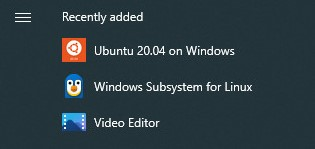

# Docker on Windows via WSL

## Prerequisites

The Hummingbot codebase is designed and optimized for UNIX-based systems such as macOS and Linux. For Windows users, we recommend running Hummingbot in Windows Subsystem for Linux (WSL).

- You must be running Windows 10 version 2004 and higher (Build 19041 and higher) or Windows 11

- Virtualization needs to be enabled under your BIOS setting.

For troubleshooting WSL see this [link](https://learn.microsoft.com/en-us/windows/wsl/troubleshooting#installation-issues)

## 1. Install WSL

Open a Powershell or Windows command prompt as administrator and run the command below to install WSL with Ubuntu 20.04

```
wsl --install --distribution Ubuntu-20.04
```


Restart your computer to finish the WSL installation



Open the Start Menu and look for `Ubuntu 20.04" and launch it to open a WSL terminal


WSL should finish installing then it will prompt you to enter a username / password

After adding a username / password, WSL should be completely installed. Continue on to the next steps to install Docker

## 2. Install Docker

In the Ubuntu terminal, enter the commands below one by one

```
sudo apt-get update && sudo apt-get upgrade -y
```

```
sudo apt-get install apt-transport-https ca-certificates curl software-properties-common gnupg lsb-release
```

```
curl -fsSL https://download.docker.com/linux/ubuntu/gpg | sudo apt-key add -
```

```
sudo add-apt-repository "deb [arch=amd64] https://download.docker.com/linux/ubuntu  $(lsb_release -cs)  stable"
```

```
sudo apt update && sudo apt-get install docker-ce
```

```
sudo service docker start 
```

```
sudo usermod -aG docker $USER
```

```
exit
```

## 3. Install Hummingbot

### Using Helper Scripts

!!! note "Download Helper Scripts here"

    === "Create Script"

        ``` markdown
        wget https://raw.githubusercontent.com/hummingbot/hummingbot/master/installation/docker-commands/create.sh
                
        ```

    === "Start Script"

        ``` markdown
        wget https://raw.githubusercontent.com/hummingbot/hummingbot/master/installation/docker-commands/start.sh
        ```

    === "Update Script"

        ``` markdown
        wget https://raw.githubusercontent.com/hummingbot/hummingbot/master/installation/docker-commands/update.sh
        ```

Enable script permissions

```
chmod a+x *.sh
```

Run the `create` script to launch a Hummingbot instance

```
./create.sh
```

### Manual Method

Create folder for your new instance

```
mkdir hummingbot_files
```

Create folders for logs, config files and database file

```
mkdir hummingbot_files/hummingbot_conf
mkdir hummingbot_files/hummingbot_conf/connectors
mkdir hummingbot_files/hummingbot_conf/strategies
mkdir hummingbot_files/hummingbot_certs
mkdir hummingbot_files/hummingbot_logs
mkdir hummingbot_files/hummingbot_data
mkdir hummingbot_files/hummingbot_scripts
mkdir hummingbot_files/hummingbot_pmm_scripts
mkdir hummingbot_files/gateway_conf
mkdir hummingbot_files/gateway_logs
```

Launch a new instance of hummingbot

```
docker run -it \
--network host \
--name hummingbot-instance \
--mount "type=bind,source=$(pwd)/hummingbot_files/hummingbot_conf,destination=/conf/" \
--mount "type=bind,source=$(pwd)/hummingbot_files/hummingbot_logs,destination=/logs/" \
--mount "type=bind,source=$(pwd)/hummingbot_files/hummingbot_data,destination=/data/" \
--mount "type=bind,source=$(pwd)/hummingbot_files/hummingbot_pmm_scripts,destination=/pmm_scripts/" \
--mount "type=bind,source=$(pwd)/hummingbot_files/hummingbot_scripts,destination=/scripts/" \
--mount "type=bind,source=$(pwd)/hummingbot_files/hummingbot_certs,destination=/home/hummingbot/.hummingbot-gateway/certs/" \
--mount "type=bind,source=$(pwd)/hummingbot_files/gateway_conf,destination=/gateway-conf/" \
hummingbot/hummingbot:latest
```

## Additional Resources

The [Hummingbot DockerHub](https://hub.docker.com/r/hummingbot/hummingbot) publishes Docker images for the `master` (latest) and `development` builds of Hummingbot starting with version 1.5.0. For previous versions you may download the docker images from [CoinAlpha's Dockerhub](https://hub.docker.com/r/coinalpha/hummingbot)

:fontawesome-brands-youtube: [Using Docker Compose to launch multiple Hummingbots](https://www.youtube.com/watch?v=LU-4Ui-KCtY)
