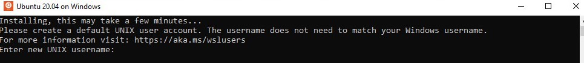

# Source on Windows via WSL

## Prerequisites

The Hummingbot codebase is designed and optimized for UNIX-based systems such as macOS and Linux. For Windows users, we recommend running Hummingbot in Windows Subsystem for Linux (WSL).

- You must be running Windows 10 version 2004 and higher (Build 19041 and higher) or Windows 11

- Virtualization needs to be enabled under your BIOS setting.

For troubleshooting WSL see this [link](https://learn.microsoft.com/en-us/windows/wsl/troubleshooting#installation-issues)

## 1. Install WSL

Open a Powershell or Windows command prompt as administrator and run the command below to install WSL with Ubuntu 20.04

```
wsl --install --distribution Ubuntu-20.04
```


Restart your computer to finish the WSL installation


Open the Start Menu and look for `Ubuntu 20.04" and launch it to open a WSL terminal



WSL should finish installing then it will prompt you to enter a username / password

After adding a username / password, WSL should be completely installed. Continue on to the next steps to install the Source version

## 2. Install Hummingbot via Source

Launch the Ubuntu terminal and paste the following commands below one by one

```
sudo apt-get update
```

```
sudo apt-get install -y build-essential
```

```
wget https://repo.continuum.io/miniconda/Miniconda3-latest-Linux-x86_64.sh
```

```
sh Miniconda3-latest-Linux-x86_64.sh
```

```
exec bash
```

```
git clone https://github.com/hummingbot/hummingbot.git
```

```
cd hummingbot && ./clean && ./install
```

```
conda activate hummingbot && ./compile
```

```
bin/hummingbot.py
```

## 3. Launch Hummingbot

In the terminal make sure you are within the Hummingbot folder then run the following commands below to launch Hummingbot

```
conda activate hummingbot
```

```
bin/hummingbot.py
```

## Additional Resources
